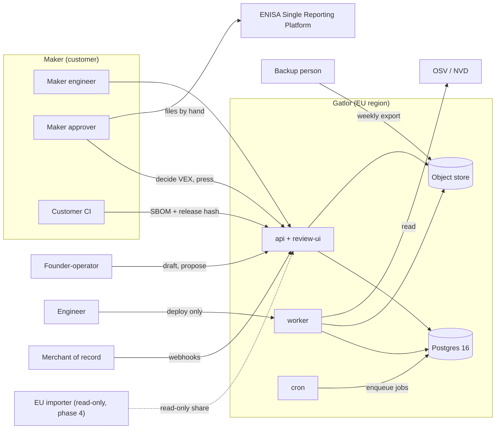
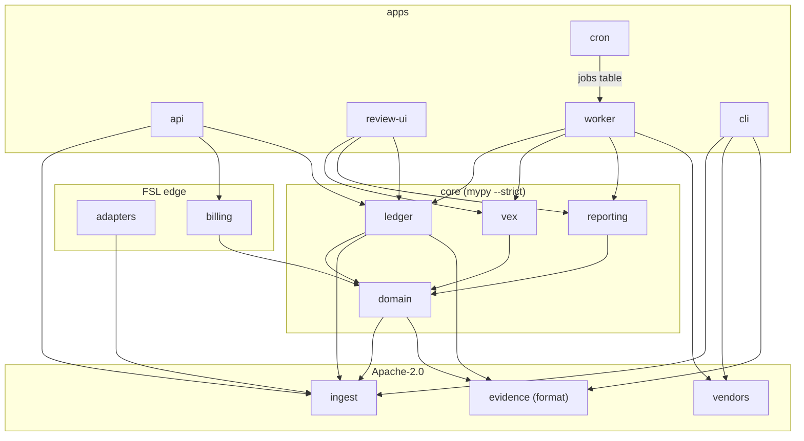
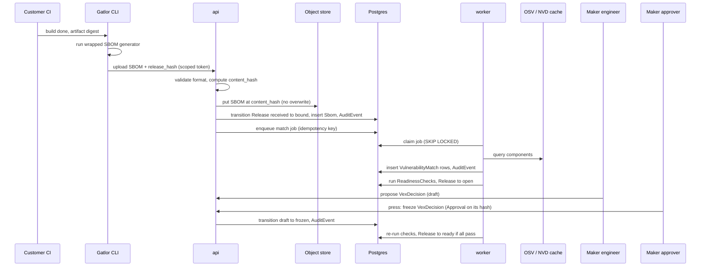
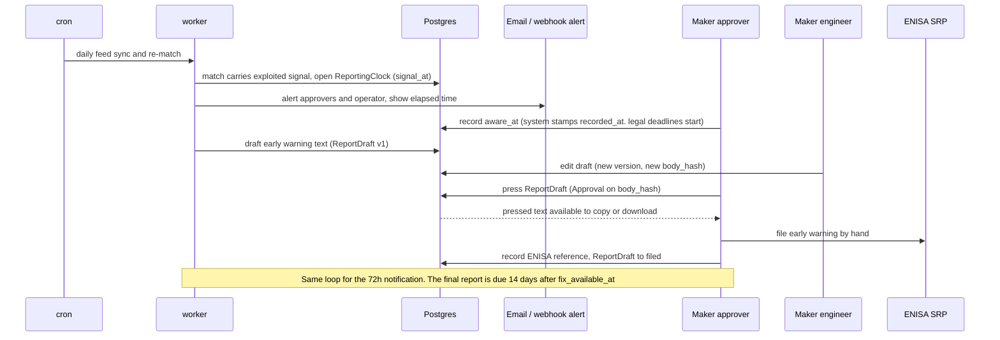
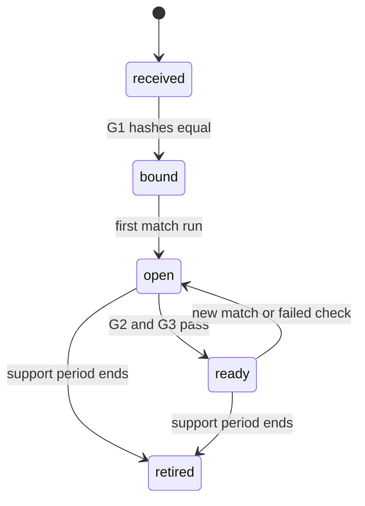
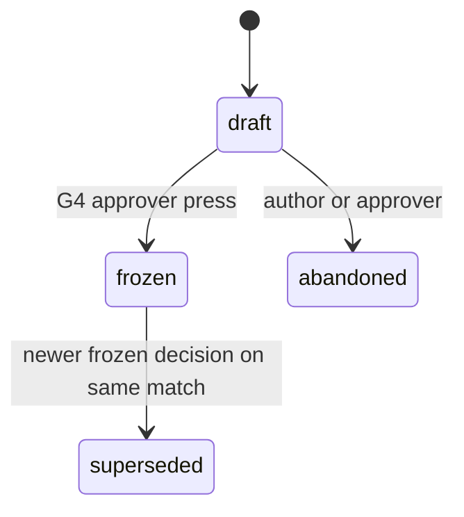
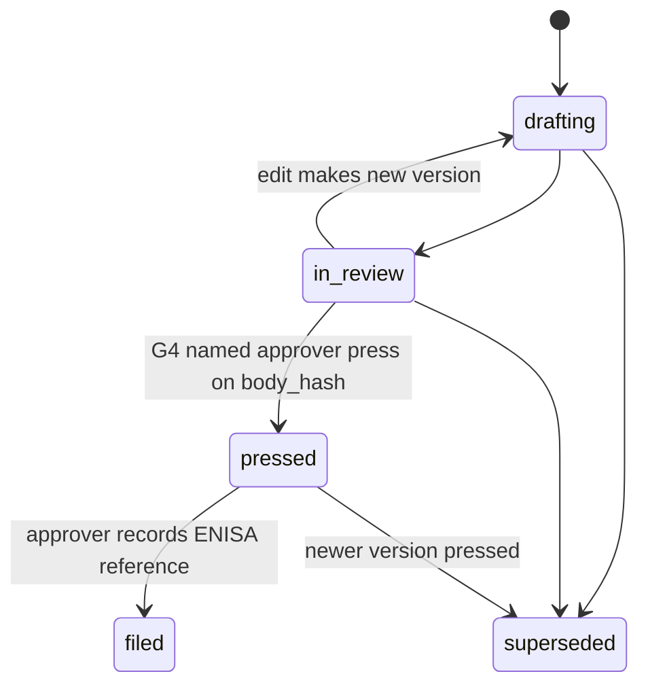
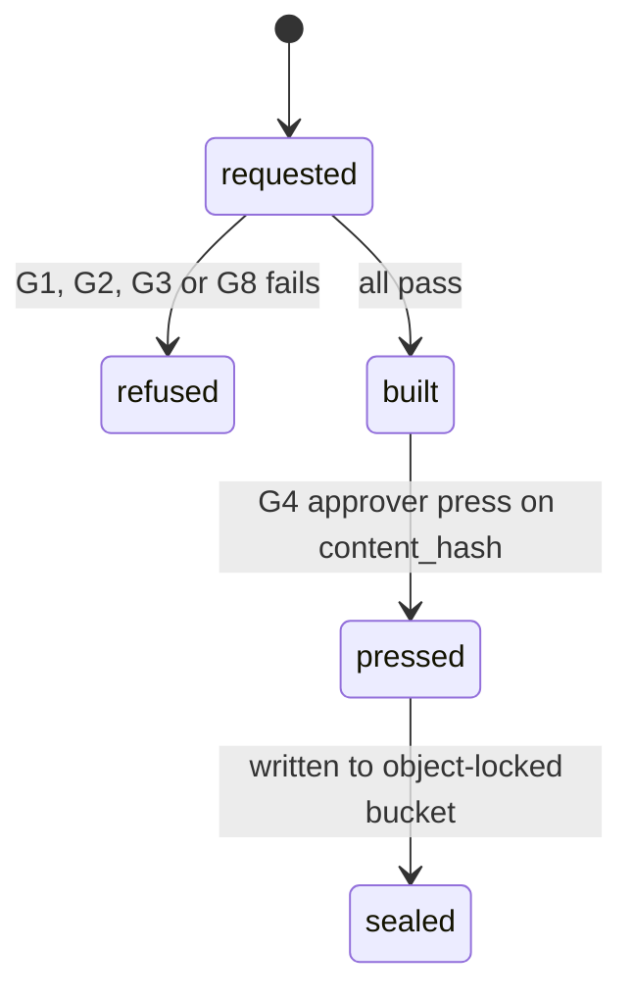
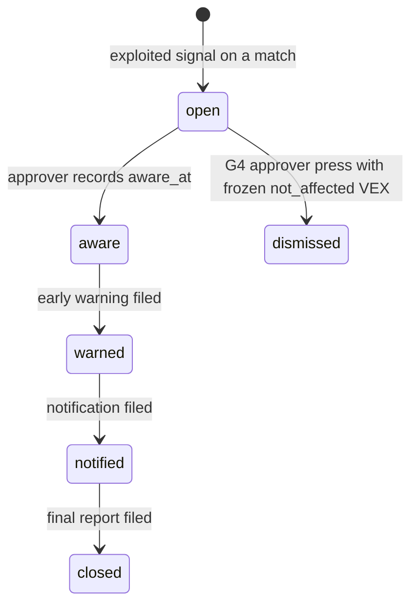

# Gatlor: architectural blueprint

Owner: Suresh Jaladanki. Design date: 6 October 2026.

Copyright 2026 Suresh Jaladanki. This file is the product contract. The works treated as the source of truth for this product are the code, tests, and signed commits.

Part A says what Gatlor sells and what it never does. Part B is the evidence ledger engineers build. Clock: alerts from `signal_at`; legal deadlines from maker `aware_at`. Commercial terms (prices, cadence) are not in this file.

---

# Part A. Commercial contract

## 1. Status

| Item | Value |
|---|---|
| This repo | Gatlor: CRA engineering for small makers, delivered as a build-in sprint then a subscription evidence ledger |
| Persona studio | Paused as the primary business. Lives in `project-avatar`. No persona, desk or social code here |
| Products in this repo | One: Gatlor |

## 2. Terms

| Term | Meaning |
|---|---|
| CRA | EU Cyber Resilience Act |
| Maker | The customer: a company with 10–249 staff selling a connected device or installable software into the EU |
| Product line | The unit a sprint and a ledger plan are priced on. Holds one or more products |
| Release | One shipped version of a product, identified by its content hash (`release_hash`) |
| SBOM | Software bill of materials: machine-readable list of components in one release, stored by content hash |
| VEX | Vulnerability exploitability statement: a recorded decision on whether a known vulnerability affects the product, with a reason and who decided |
| Technical file | Documentation the maker keeps to show the product meets CRA essential requirements. Gatlor assembles an export of it from evidence history |
| Clock | CRA Article 14 deadlines for an actively exploited vulnerability: early warning 24h, notification 72h, final report 14 days after a fix. Filed through ENISA's Single Reporting Platform by the maker |
| Press | A named human's recorded approval of one subject, bound to that subject's content hash |
| Human-press invariant | No report text and no technical-file export leaves the system without a named human press |
| Gate | A guard in code that refuses a state transition. Not a dashboard colour |
| Kept revenue | Cash after payment and transfer fees, before tools, tax and founder's draw |
| (OT) | Operating threshold set by this doc, not by market research or counsel |

## 3. The job

**One job:** every release has a true SBOM, every known vulnerability that touches it has a recorded decision, every exploited one has its reports drafted inside the clock, and the technical file builds itself from that history. A failed check blocks the release-evidence export.

| | What |
|---|---|
| **Sell** | Free CLI and CI action. Scope review. Build-in sprint per product line. Ledger subscription. Triage retainer. Indie kit as distribution |
| **Build** | Evidence ledger: CI upload stored by content hash, daily vulnerability match, VEX with reason codes, reporting clock with drafted texts, technical-file export, append-only audit log, EU hosting |
| **Never** | Claim a product is compliant or certified. Give legal opinions. Act as a notified body. File to ENISA for a customer, or auto-submit. Run 24/7 cover. Analyse binary firmware in house. Build generic GRC, ISO 27001 or NIS2 crosswalks. Ship a consumer subscription app or a marketplace. Do persona work in the first 12 months. Backdate evidence. Delete a VEX decision (supersede only). Hide a vulnerability to make a dashboard green |

## 4. Offers, who pays, human vs software, sequence

**Offers.** The CLI and CI action are free (Apache-2.0). Paid tiers exist (indie kit, scope review, build-in sprint, ledger subscription, triage retainer). Prices are published on the website when the product is sold, not here.

**Who pays and how.**

| Channel | Used for | Not used |
|---|---|---|
| Merchant of record (Paddle or Lemon Squeezy, one chosen on first use) | Indie kit, ledger subscriptions | Gumroad, Whop |
| Direct invoice, bank transfer | Scope reviews, sprints, retainers | Card capture by Gatlor |
| Gatlor itself | Records invoices and webhooks | Checkout, storefront, card payment |

**Human vs software (short).** Full table in §17.

| Software | Human |
|---|---|
| Stores SBOMs, matches vulnerabilities, runs readiness checks | The maker's named approver decides each VEX |
| Starts alerts on an exploited signal, drafts the 24h, 72h and 14-day texts | The maker confirms awareness (that starts the legal clock), presses the draft, and files with ENISA |
| Assembles the technical-file export and refuses it when a gate fails | The maker's named approver presses the export |
| Lints copy for claim language | The founder signs contracts and gets counsel to review claims and the statement of work |

**Sequence.** The engineering build order is §16.

---

# Part B. Evidence ledger

## 5. Verdict

Build one modular monolith. It turns CI uploads into an append-only evidence history per release. It refuses any export, VEX change or report release that would break the job in §3. Open-source scanners are called, not rewritten. Customer data is hosted in an EU region from day 1. Every rule that matters is a guard in `packages/domain`, run by one transition function that writes an audit event.

## 6. Problem, goals, non-goals

**Problem.** A small maker has CI, maybe an SBOM generator, and no record linking each shipped release to its components, its known vulnerabilities, the decisions taken on them, and the reports owed under Article 14. When a vulnerability is exploited, the 24-hour clock starts before anyone has found the right release.

| Goals | Non-goals |
|---|---|
| Every release bound to an SBOM by content hash | Generating SBOMs ourselves (we wrap existing generators) |
| Every match on a supported release has a current VEX decision or blocks export | Binary firmware analysis |
| Clock deadlines computed and alerted the moment an exploited signal lands | Filing to ENISA, or any outbound path to ENISA |
| Draft report texts ready inside the clock | Legal opinion on whether a product meets the CRA |
| Technical-file export assembled from history, never hand-edited | GRC, ISO 27001, NIS2 crosswalks |
| Audit history a regulator, importer or backup person can read | 24/7 human monitoring |
| EU hosting, small ops footprint | Checkout, storefront, marketplace |

## 7. System context

| Actor | Role in the system |
|---|---|
| Maker engineer | Customer seat (`contributor`). Wires CI, uploads, proposes VEX, edits drafts |
| Maker approver | Customer seat (`approver`). Named human who decides VEX, presses exports and reports, files with ENISA, records the filing reference |
| Founder-operator | Gatlor staff (`operator`). Runs sprints, reviews and retainers. Can draft and propose in a customer account. Cannot press for a customer |
| Engineer | Gatlor staff (`engineer`). Builds and deploys. No press or export permission in prod. If the same person acts as operator, that is a separate recorded action |
| Backup person | Reads the weekly object-locked export without the app if the founder is unavailable |
| Counsel | Reviews statement-of-work terms, claim language and retention. Outside the system |

| System | Direction | Notes |
|---|---|---|
| Customer CI (GitHub, GitLab, generic) | In | Uploads SBOM plus release hash with a scoped token |
| OSV, NVD | In | Vulnerability feeds, cached. OSV first, NVD for enrichment |
| Merchant of record | In | Subscription and kit webhooks |
| Email provider | Out | Alerts and notices, copy passes the claims lint |
| EU importer/distributor | Out, read-only | Phase 4 share |
| ENISA Single Reporting Platform | **Out of system** | Humans at the maker file there. No code path to it |

## 8. Architecture

**Shape.** Modular monolith: one codebase, one Postgres, one object store, one container image run as three process roles.

| Process | Runs |
|---|---|
| `api` | FastAPI: auth, CI upload, billing webhooks, and the `review-ui` routes (server-rendered HTML + HTMX) |
| `worker` | Jobs from the Postgres queue (`SELECT … FOR UPDATE SKIP LOCKED`): ingest, match, readiness checks, clock, drafts, export |
| `cron` | Enqueues daily feed sync and re-match, clock ticks, nightly audit-chain verify, weekly records export |

**Stack.** Python 3.12, `uv`, `ruff`, `mypy --strict` on `domain`, `ledger`, `vex`, `reporting`. Postgres 16 is the system of record and the job queue. No Redis, no extra broker. S3-compatible object storage (MinIO locally). Server-rendered UI, no SPA. OpenTofu for infra. OpenTelemetry for traces, metrics and logs.

**Modules.** Apache packages import no FSL package. Shared format types stay in Apache (`ingest`, `evidence`). FSL packages may import Apache.

| Path | Licence | Owns | May import |
|---|---|---|---|
| `apps/api` | FSL | HTTP, auth, CI upload endpoint, MoR webhooks | packages |
| `apps/review-ui` | FSL | Server-rendered pages, HTMX partials | packages |
| `apps/worker` | FSL | Job runner | packages |
| `apps/cron` | FSL | Schedules | packages |
| `apps/cli` | Apache-2.0 | Free CLI + CI action | `ingest`, `vendors`, `evidence` |
| `packages/domain` | FSL | Entities, state machines, guards, the one `transition()` function, audit event shape | stdlib, Pydantic, Apache format packages |
| `packages/evidence` | Apache-2.0 | CLI format: checklist, in-triage VEX document, claims lint | Apache packages only |
| `packages/ledger` | FSL | SBOM store, hash binding, readiness checks, technical-file export | `domain`, Apache format packages |
| `packages/vex` | FSL | Decisions, reason codes, supersede-not-delete, later ranked suggestions | `domain` |
| `packages/reporting` | FSL | Clock, 24h, 72h and 14-day drafts, human press | `domain` |
| `packages/ingest` | Apache-2.0 | CycloneDX/SPDX parse and validate | Apache packages only |
| `packages/adapters` | FSL | GitHub, GitLab, generic CI | `ingest` |
| `packages/vendors` | Apache-2.0 | OSV, NVD, scanner wrappers (Syft, Grype and similar, called not rewritten) | Apache packages only |
| `packages/billing` | FSL | MoR webhooks, invoice records, kept revenue. No card capture | `domain` |
| `packages/evals` | Apache-2.0 | Golden SBOM and VEX fixtures for Apache packages | Apache packages only |

`domain` imports no vendor SDK, no HTTP client, no database driver.

Licences: [licensing.md](licensing.md). CLI, ingest, vendors, and evidence format code are Apache-2.0. Ledger modules (`domain`, `ledger`, `vex`, `reporting`, `billing`, `adapters`, `api`, `review-ui`, `worker`, `cron`) are FSL-1.1-ALv2, source-available, not OSI open source. Store, hash binding, and technical-file export belong in `packages/ledger/`, not in Apache `packages/evidence`.

**Sequence 1: CI upload to VEX decision.**

**Sequence 2: exploited vulnerability to customer filing.**

## 9. Data model

Every customer-data table has `customer_id`, and Postgres row-level security is on. Timestamps are UTC and timezone-aware. `recorded_at` is always set by the server and never updated. Money is integer euro cents.

| Entity | Key fields | Gate it enables |
|---|---|---|
| Customer | `customer_id`, `legal_name`, `country`, `plan`, `data_region` (EU only), `created_at` | EU hosting, plan limits |
| ProductLine | `product_line_id`, `customer_id`, `name` | Sprint and plan unit |
| Product | `product_id`, `product_line_id`, `name`, `category` (default first), `support_period_end` | Which releases are re-matched |
| Release | `release_id`, `product_id`, `version`, `release_hash`, `ci_run_ref`, `state`, `recorded_at` | Hash binding |
| Sbom | `sbom_id`, `release_id`, `release_hash`, `content_hash`, `format`, `spec_version`, `object_key`, `generator`, `recorded_at` | Export needs `Sbom.release_hash == Release.release_hash` |
| VulnerabilityMatch | `match_id`, `release_id`, `sbom_id`, `vuln_id`, `aliases`, `component_purl`, `feed`, `feed_record_hash`, `exploited_signal`, `first_seen_at`, `status` (`open`, `decided`, `withdrawn_by_feed`) | Undecided matches block export |
| VexDecision | `vex_decision_id`, `match_id`, `status` (`not_affected`, `affected`, `fixed`, `under_investigation`), `justification` (required when `not_affected`), `action_statement` (required when `affected`), `decided_by`, `approval_id`, `supersedes_id`, `state`, `recorded_at` | Supersede-not-delete |
| ReportingClock | `clock_id`, `match_id`, `product_id`, `signal_at`, `aware_at`, `aware_recorded_by`, `fix_available_at`, `early_warning_due`, `notification_due`, `final_due`, `state`, `recorded_at` | Deadlines and alerts |
| ReportDraft | `report_draft_id`, `clock_id`, `kind` (`early_warning`, `notification`, `final`), `version`, `body_hash`, `object_key`, `state`, `approval_id`, `filed_reference`, `filed_by`, `filed_at` | No release without press |
| TechnicalFileExport | `export_id`, `release_id`, `release_hash`, `input_hash`, `content_hash`, `object_key`, `state`, `refusal_reasons`, `approval_id`, `recorded_at` | No export without pass |
| ReadinessCheck | `check_id`, `release_id`, `rule_id`, `rule_version`, `input_hash`, `result` (`pass`, `fail`), `detail`, `recorded_at` | A failed check blocks export |
| Seat | `seat_id`, `customer_id` (null for staff), `email`, `role` (`admin`, `approver`, `contributor`, `viewer`, `operator`, `engineer`), `second_factor`, `status` | Who may press |
| InvoiceRecord | `invoice_id`, `customer_id`, `source` (`mor`, `direct`), `external_ref`, `amount_cents`, `fees_cents`, `kept_cents`, `status`, `webhook_event_hash`, `recorded_at` | Kept revenue, idempotent webhooks |
| Approval | `approval_id`, `subject_type`, `subject_id`, `subject_hash`, `action` (`freeze_vex`, `press_export`, `press_report`, `dismiss_clock`), `pressed_by`, `recorded_at` | A press covers one subject and one hash |
| AuditEvent | `event_id`, `seq`, `prev_hash`, `event_hash`, `actor_seat_id`, `action`, `subject_type`, `subject_id`, `subject_hash`, `payload_hash`, `recorded_at` | Append-only, hash-chained |

**Source of truth vs cache.**

| Truth | Cache |
|---|---|
| Postgres rows above | OSV and NVD mirrors (re-fetchable). The `feed_record_hash` and a snapshot of the record used by each match are kept as truth |
| Object-store blobs addressed by content hash (SBOMs, drafts, exports) | Rendered UI views, search indexes |
| Object-locked weekly records export | Job rows after completion |

**Retention (OT, pending counsel).**

| Data | Keep |
|---|---|
| Release, Sbom, VulnerabilityMatch, VexDecision, ReadinessCheck, ReportingClock, ReportDraft, TechnicalFileExport, Approval, AuditEvent | At least ten years after the product's last release or the end of its support period, whichever is later |
| Seat email and name | While the seat is active. On removal, pseudonymise. The audit chain keeps `seat_id` only |
| InvoiceRecord | Period set by the tax rules of the operating entity (counsel) |
| Application logs | 30 days |
| Feed cache | Rolling. Snapshots referenced by matches are kept with the match |

## 10. Evidence pipeline

Every step is a pure transform plus one write. Idempotency key = hash of inputs + step version + config. Re-running a step with the same key returns the stored output and writes nothing new.

| Step | Input | Output | Notes |
|---|---|---|---|
| 1. Receive | Upload (SBOM bytes, `release_hash`, token) | Stored blob at `content_hash` | Reject if the token is not scoped to the product. Never overwrite a blob |
| 2. Parse | Blob | Normalised component list | CycloneDX first, SPDX accepted. Official format libraries, not hand-rolled parsers |
| 3. Bind | Release + Sbom | Release `bound` | Guard: `release_hash` equal on both |
| 4. Match | Components + feed snapshot | `VulnerabilityMatch[]` | OSV query through `vendors`. Scanners and feeds wrapped, not rewritten |
| 5. Re-match (daily) | All supported releases + new feed snapshot | New matches, withdrawn-by-feed marks | Supported means today is on or before `support_period_end` |
| 6. Check | Release + matches + decisions | `ReadinessCheck[]` | Rules are versioned code. A new rule version re-runs checks |
| 7. Suggest (phase 5) | Match + product facts | Ranked VEX suggestions | Display only. A human decides |
| 8. Clock | Match with exploited signal | ReportingClock + first draft | See §12 |
| 9. Export | Release + Sbom + frozen decisions + passing checks | TechnicalFileExport | Refused with reasons if any gate fails |
| 10. Seal | Pressed export | Copy in object-locked bucket | Weekly records export uses the same bucket |

New evidence for a changed build is a new Release. An SBOM is never repaired in place.

## 11. Lifecycle, state machines and guards

Every state change goes through `domain.transition(subject, to_state, actor, approval=None)`. It runs that transition's guards and writes one AuditEvent in the same database transaction. No other code updates a `state` column.

**Gates (vocabulary used across the repo).**

| ID | Gate | Refuses |
|---|---|---|
| G1 | Hash-bound | Any export unless an Sbom is bound to the same `release_hash` |
| G2 | Decided | Any export while a match on the release is `open` with no frozen VexDecision. **Invariant: blocks, does not mark incomplete** |
| G3 | Checks pass | Any export while any ReadinessCheck at the current rule versions is `fail` |
| G4 | Pressed | Sealing an export, freezing a VEX decision, or releasing a report draft without an Approval by a customer `approver` whose `subject_hash` matches |
| G5 | Supersede, not delete | Any delete on VexDecision. A change is a new frozen decision with `supersedes_id`. Both stay in the audit chain |
| G6 | No backdating | Any write that sets or changes `recorded_at` from client input |
| G7 | Append-only audit | Any update or delete on AuditEvent (no grants). A broken chain is P1 |
| G8 | Claims lint | UI, export, email and draft templates containing "compliant", "certified", "CRA-ready" or "guarantee" |
| G9 | No ENISA path | Any outbound code path to ENISA. Checked by a contract test on configured hosts |

**Release.**

**VexDecision.**

Guards: `not_affected` needs a `justification` from the fixed reason-code list. `affected` needs an `action_statement`. `under_investigation` counts as a decision, but readiness check `vex-investigation-age` fails it after 14 days (OT), which blocks export through G3.

**ReportDraft.**

Any edit after a press is a new version with a new `body_hash`. The old version and its press stay.

**TechnicalFileExport.**

A refused export lists every failing gate. A sealed export is an immutable snapshot "as of" its `recorded_at`. Later matches do not change it. They block the next export.

**ReportingClock.**

`fix_available_at` may be recorded in any state from `aware` on. It sets `final_due`.

## 12. Reporting clock and human press

| Rule | Value |
|---|---|
| Who owns the clock | The maker. Contract and UI both say so |
| What Gatlor does | Alerts on the exploited signal, drafts texts, records presses and filing references, computes deadlines once awareness is recorded |
| What Gatlor never does | Files, submits or posts to ENISA. Holds the only copy of a filed text |
| Clock start | Alerts fire at `signal_at` (when Gatlor saw the exploited signal). Legal deadlines run from `aware_at` (the maker confirms it is aware). Both are shown with their `recorded_at`. (OT, pending counsel: confirm this matches Article 14.) |
| Deadlines | `early_warning_due` = `aware_at` + 24h. `notification_due` = `aware_at` + 72h. `final_due` = `fix_available_at` + 14 days |
| Alerts (OT) | On `signal_at`, then until `aware_at` is recorded, then at 12h, 4h and 1h before each deadline with no pressed draft. Sent by email and webhook to every customer approver and to the operator |
| Hours | Software alerts around the clock. Human cover comes from the maker. Gatlor staff work EU business hours only. No 24/7 |
| Press | One Approval covers one ReportDraft version (`body_hash`). The press records who and when. Engineers cannot press. Staff never press for a customer |
| Draft content | Template per `kind`, filled from Release, Product, match and VEX facts. Passes G8 |
| After filing | The approver records `filed_reference`, `filed_by`, `filed_at`. Gatlor never verifies against ENISA |

## 13. CI/CD, environments, secrets, contract tests

**Environments.**

| Env | Data | Scanners/feeds | CI | Billing |
|---|---|---|---|---|
| local | Docker Postgres, MinIO | Fakes and recorded fixtures | Fake adapters | Fake webhooks |
| staging | Synthetic records | Real feeds, low caps | Canary / test repos | MoR test mode; test product |
| prod | Real | Real, EU region | Customer CI | Live MoR + invoicing |

**Secrets.** None in the repo. Prod and staging secrets live in the hosting provider's secret store, wired through `infra/` (OpenTofu). Local uses an uncommitted `.env`. Customer CI tokens are scoped per product line and stored hashed.

**PR pipeline** (all must pass to merge):

1. `ruff check` and `ruff format --check`
2. `mypy --strict` on `domain`, `ledger`, `vex`, `reporting` (and `packages/evidence` while it is the only typed tree)
3. `pytest` unit and contract tests, including the Apache-must-not-import-FSL check
4. Evals (`packages/evals` golden fixtures) when `evidence`, `ledger`, `vex`, `ingest`, `vendors` or `evals` change
5. Claims lint over templates and copy (G8)
6. Migration check: no `UPDATE`/`DELETE` grant on `audit_event` or `vex_decision`
7. `tofu plan` when `infra/` changes. Non-EU region in the plan fails

**Deploy.** One image. Staging deploys on merge. Prod deploys on an operator action, recorded as its own audit event.

**Contract tests (must exist before ledger v1 takes customer data).**

| Test | Asserts |
|---|---|
| hash-binding | Bind fails when `Sbom.release_hash != Release.release_hash`. Export fails with no bound Sbom |
| no-export-without-pass | Export is refused when any match is undecided or any check fails. Refusal lists reasons |
| no-report-without-press | ReportDraft cannot reach `pressed` without an approver Approval on its exact `body_hash`. An engineer or operator Approval is refused |
| vex-supersede-not-delete | Delete raises. A new decision supersedes. Both readable. Chain intact |
| no-backdating | Client-supplied `recorded_at` is ignored or rejected. No path updates `recorded_at` |
| audit-chain | Each event's `prev_hash` equals the previous `event_hash`. Tampering is detected |
| no-enisa-path | No adapter or config targets an ENISA host |
| gate-flag-on-read | A feature flag that changes a gate is read on every guard call, not cached at toggle |
| idempotent-steps | The same idempotency key returns the stored output and writes no new rows |
| claims-lint | Seeded forbidden words in a template fail the build |

## 14. Observability, SLIs, alerts, runbooks

OpenTelemetry traces, metrics and logs. Logs carry ids and hashes, not SBOM contents or report text.

| SLI | Target (OT) |
|---|---|
| Upload accepted to Release `bound` | 95% under 2 minutes |
| Feed snapshot age | Under 24 hours |
| Exploited signal to first alert sent | Under 15 minutes |
| Nightly audit-chain verify | Passes every night |
| Export build (gates pass) | Under 10 minutes |

| Alert | Severity | Runbook |
|---|---|---|
| Clock deadline under 4h with no pressed draft | P1 to customer approvers. Operator notified | `runbooks/missed-clock.md` |
| Alert delivery failed for an open clock | P1 | `runbooks/missed-clock.md` |
| Audit chain broken | P1 | `runbooks/broken-audit-chain.md` |
| Any customer data resource outside the EU region | P1 | `runbooks/eu-hosting.md` |
| Feed sync stale over 24h | P2 | `runbooks/feed-outage.md` |
| Customer asks to suppress a match or backdate evidence | P1 (business) | `runbooks/suppress-request.md` |
| Claims lint hit in prod copy | P2, fix same day | `runbooks/claims-language.md` |
| Weekly records export missing | P2 | `runbooks/backup-read.md` |

## 15. Security, privacy, roles, audit, claims

| Area | Rule |
|---|---|
| Tenancy | `customer_id` on every customer-data row. Postgres row-level security |
| Auth | Every seat signs in. Approver seats need a second factor before any press |
| Roles | `admin` (seats, billing), `approver` (freeze VEX, press export, press report, dismiss clock), `contributor` (upload, propose, edit drafts), `viewer`. Staff: `operator` (draft and propose in customer accounts, deploy prod), `engineer` (build, no press, no export in prod). Staff never press for a customer |
| Separation | If one person holds both staff roles, each action records which role was used |
| Audit | Append-only hash-chained `audit_event`. No update or delete grants. Nightly verify. Every transition, press, seat change and export writes one event |
| Storage | Blobs addressed by content hash. Sealed exports and weekly records in an object-locked bucket |
| Hosting | Customer data in an EU region from day 1. Founder access from India is remote access to EU-hosted data. Transfer terms per counsel |
| Privacy posture | Gatlor processes maker staff contact data and release metadata on the maker's behalf. Minimal personal data. Pseudonymise on seat removal. DPA template and GDPR/DPDP position from counsel. This is an operating checklist, not legal advice |
| Claims | Product copy, exports, drafts and emails never say "compliant", "certified" or "CRA-ready guaranteed". Every export carries a fixed notice: "This export is a record of evidence held in Gatlor. It is not a statement that the product meets the Cyber Resilience Act." |
| Suppression | No feature hides, mutes or deletes a match. `withdrawn_by_feed` is set only from feed data |

## 16. Build order for engineers

Phases overlap. Engineering order:

| Phase | When | Ships | Done when |
|---|---|---|---|
| 0 | Days 1–30 | `apps/cli` + CI action: wraps an SBOM generator and OSV, writes CycloneDX SBOM, VEX file, readiness checklist. Founder's own SBOM, disclosure policy and support period published | Public. Runs on the founder's own repo in CI |
| 1 | Days 30–75 | Sprint 1 delivered by hand. Every manual step logged as a ledger requirement | Requirements list mapped to §10 steps |
| 2a | Days 45–75 | Ledger core: `domain`, `packages/ledger/`, `transition()`, audit chain, upload, store by hash, bind, match, VEX with reason codes, readiness checks, review UI, EU hosting, contract tests from §13 | Runs against the sprint-1 customer's pipeline |
| 2b | Days 60–90 | Reporting clock with drafted texts, technical-file export with gates, press flow, weekly records export, MoR webhooks into InvoiceRecord | First paying ledger customer on it |
| 3 | Months 4–9 | Self-serve onboarding. CI templates for the three ecosystems first customers use (embedded Linux / Yocto or Buildroot if conversations confirm). Kit checkout through MoR | A customer goes from signup to first bound release without the founder |
| 4 | Months 9–15 | Read-only evidence share for an EU importer/distributor (Team plan) | Importer reads exports and VEX without a seat that can write |
| 5 | Months 12–18 | Ranked VEX suggestions. Display only, a human decides | Evals show suggestions never change a frozen decision |
| 6 | Conditional | AI-marking add-on | Only if three or more ledger customers ship generative features and ask |

Limits: at most three build ecosystems until 20 ledger customers. German/French UI only after ten customers who need it.

## 17. What remains human

| Decision or act | Who | Software role |
|---|---|---|
| Whether a vulnerability affects the product (VEX) | Maker approver | Shows the match, the feed record, and later ranked suggestions. Records the decision and the press |
| When the maker became aware of exploitation | Maker approver | Records `signal_at`, the asserted `aware_at`, and `recorded_at`. Computes deadlines from `aware_at` |
| Content of the early warning, notification, final report | Maker engineer drafts. Maker approver presses | Pre-fills templates. Lints claims |
| Filing with ENISA | Maker approver | None. Records the reference afterwards |
| Releasing a technical-file export | Maker approver | Builds it, refuses it on gate failure, seals it after the press |
| Product category and support period | Maker | Stores them. Uses support period for re-match scope |
| Whether the product meets the CRA | Maker, with its own advisers | None. Never stated |
| Sprint scope, acceptance, drill | Founder-operator with the maker's people | Records the outcome as evidence |
| Contracts, statement of work, claim language | Founder, with counsel | Claims lint on product copy |
| Suppress or backdate request | Founder ends the engagement the same day | No feature exists to do either |
| Prod deploy | Operator | Recorded as an audit event |
| Reading records if the founder is unavailable | Backup person | Weekly object-locked export readable without the app |
